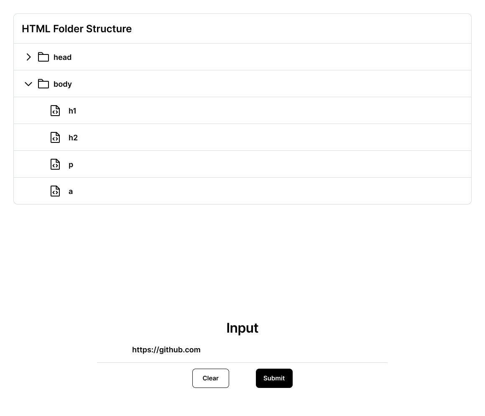

# HTML Parser

An applicaton built with React and TS that allows a user get the HTML structure of any website.

## Summary
The application logic and user interface was completed according to the specifications
in the <a href="#prompt">prompt.</a>

The goal was to create a logic and UI that allows user enter a URL and the app returns the list
of HTML elements on the webpage in a parsed format.

## Requirements
- Node 16
- npm or yarn

## Installation instructions
```
yarn && yarn start
```

Then go to http://localhost:3000 in your browser

<span id="prompt"></span>
## Prompt

Implement a React application that can:
- Allow the user to input a URL in a text box
- Allow the user to click a button that submits the URL to the parsedhtml
  endpoint found at `server/routes.js`
- Display the response visually using a folder structure where html elements
  with children have the folder icon displayed next to the html tag name and
  html elements without children have the file icon displayed next to their html
  tag name
  - Indentation should be used to show parent/child relationships among html
    elements
  - Bonus points if you can enable clicking on items in the folder structure for
    expanding and collapsing
- Allow the user to clear the folder structure by clicking on a button that
  says, "Clear"
- Enable multiple submissions

## Wireframe

